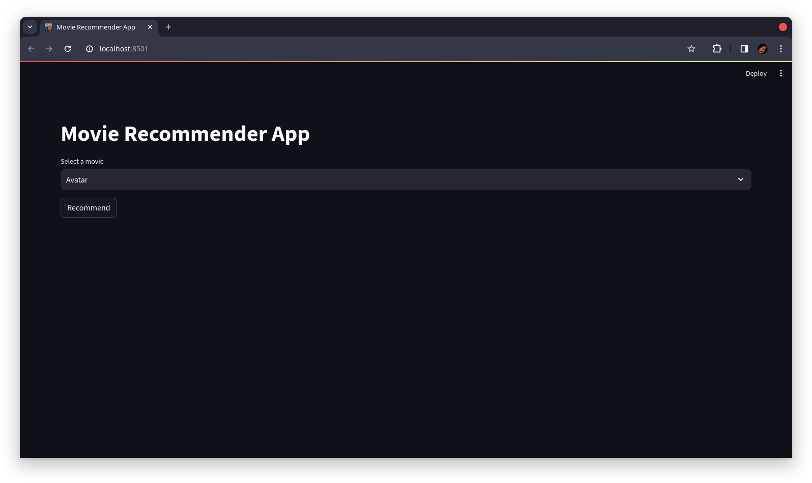

# Movie Recommender Application

In this project we are using python to create a website that will run a **_`Cosine-similarity`_** algorithm which returns the nearest or closest movies as our result.

for this we need a few packages to run this application and to host this website.

- streamlit
- pandas
- requests
- numpy
- ast
- nltk
- scikit-learn

We also need a movies dataset for our analysis which we can obtain from **Kaggle**

- [https://www.kaggle.com/datasets/tmdb/tmdb-movie-metadata/data](https://www.kaggle.com/datasets/tmdb/tmdb-movie-metadata/data)

these packages will analyse the movies data set and help us obtain our result.

### How does it work ?

Well in order to make this work we need to understand the functionality.

- Step - 1 : Create a search bar that helps the user select a movie from our data set.
- Step - 2 : Clean the data set for analysis.
- Step - 3 : Apply Cosine-similarity on the data set for the user selected movie.
- Step - 4 : Get a certain number of movies as result from Analysis.

### Project Code :

App.py

```python
import streamlit as st
from data import new_df,similarity
import pandas as pd
import requests
st.set_page_config(page_title='Movie Recommender App',page_icon='logo.png',layout='wide')
st.title('Movie Recommender App')
def fetch_poster(movie_id):
    data = requests.get(f'https://api.themoviedb.org/3/movie/{movie_id}?api_key=925f5abb87a3e487dda2cdd5babea3b8&language=en-US').json()
    return "https://image.tmdb.org/t/p/w500/"+data['poster_path']
def recommend(movie):
    movie_index = movies[movies['title'] == movie].index[0]
    distance = similarity[movie_index]
    movie_list = sorted(list(enumerate(distance)),reverse=True,key=lambda x:x[1])[1:16]
    recommended_movies = []
    recommended_movies_poster = []
    for i in movie_list:
        movie_id = movies.iloc[i[0]].movie_id
        recommended_movies.append(movies.iloc[i[0]].title)
        recommended_movies_poster.append(fetch_poster(movie_id=movie_id))
    return recommended_movies,recommended_movies_poster
movies = pd.DataFrame(new_df.to_dict())
option = st.selectbox('Select a movie',movies['title'].values)
if st.button('Recommend'):
    names,posters = recommend(option)
    col1,col2,col3,col4,col5,col6,col7 = st.columns(7)
    with col1:
        st.text(names[0])
        st.image(posters[0])
    with col2:
        st.text(names[1])
        st.image(posters[1])
    with col3:
        st.text(names[2])
        st.image(posters[2])
    with col4:
        st.text(names[3])
        st.image(posters[3])
    with col5:
        st.text(names[4])
        st.image(posters[4])
    with col6:
        st.text(names[5])
        st.image(posters[5])
    with col7:
        st.text(names[6])
        st.image(posters[6])
    col8,col9,col10,col11,col12,col13,col14 = st.columns(7)
    with col8:
        st.text(names[7])
        st.image(posters[7])
    with col9:
        st.text(names[8])
        st.image(posters[8])
    with col10:
        st.text(names[9])
        st.image(posters[9])
    with col11:
        st.text(names[10])
        st.image(posters[10])
    with col12:
        st.text(names[11])
        st.image(posters[11])
    with col13:
        st.text(names[12])
        st.image(posters[12])
    with col14:
        st.text(names[13])
        st.image(posters[13])
```

Data.py

```python
import numpy as np
import pandas as pd
import ast 
from nltk.stem.porter import PorterStemmer
from sklearn.feature_extraction.text import CountVectorizer
from sklearn.metrics.pairwise import cosine_similarity
cv = CountVectorizer(max_features=5000,stop_words='english')
ps = PorterStemmer()
def convert(obj):
    l = []
    for i in ast.literal_eval(obj):
        l.append(i['name'])
    return l
def convert3(obj):
    l = []
    counter = 0
    for i in ast.literal_eval(obj):
        if counter != 3:
            l.append(i['name'])
            counter += 1
        else :
            break
    return l
def fetch_directors(obj):
    l = []
    for i in ast.literal_eval(obj):
        if i['job'] == 'Director':
            l.append(i['name'])
            break
    return l
movies = pd.read_csv('tmdb_5000_movies.csv')
credit = pd.read_csv('tmdb_5000_credits.csv')
movies = movies.merge(credit,on='title')
movies = movies[['movie_id','title','overview','genres','keywords','cast','crew']]
movies.dropna(inplace=True)
movies['genres'] = movies['genres'].apply(convert)
movies['keywords'] = movies['keywords'].apply(convert)
movies['cast'] = movies['cast'].apply(convert3)
movies['crew'] = movies['crew'].apply(fetch_directors)
movies['overview'] = movies['overview'].apply(lambda x:x.split())
movies['genres'] = movies['genres'].apply(lambda x:[i.replace(" ","") for i in x])
movies['crew'] = movies['crew'].apply(lambda x:[i.replace(" ","") for i in x])
movies['cast'] = movies['cast'].apply(lambda x:[i.replace(" ","") for i in x])
movies['keywords'] = movies['keywords'].apply(lambda x:[i.replace(" ","") for i in x])
movies['tag'] = movies['overview'] + movies['genres'] + movies['keywords'] + movies['cast'] + movies['crew']
new_df = movies[['movie_id','title','tag']]
new_df['tag'] = new_df['tag'].apply(lambda x:" ".join(x).lower())
def stem(text):
    l = []
    for i in text.split():
        l.append(ps.stem(i))
    return " ".join(l)
new_df['tag'] = new_df['tag'].apply(stem)
vectors = cv.fit_transform(new_df['tag']).toarray()
cv.get_feature_names_out()
similarity = cosine_similarity(vectors)
```

### Output :

Output - 1

Output - 2

